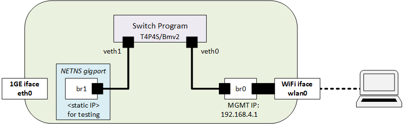
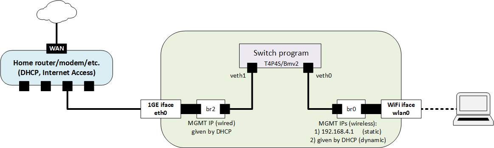

# Stateful firewall

This example shows how P4Pi can be used as a simple stateful firewall, that classifies the TCP flows. By their origin, they can either be internal or external. Every connection that started from the internal network (the TCP SYN packet comes from an internal port) should be allowed, while other external connection requests should be blocked. If a connection establishes, bidirectional communication is allowed between the initial source and destination IP addresses and TCP ports.

To this end, the example requires only one table, which we call check_ports. Check_ports table is responsible for deciding which ports to identify as internal and which ones are external.

The source code of the example is available under [T4P4S examples](https://github.com/P4EDGE/t4p4s/blob/master/examples/stateful-firewall.p4).

## How it works

This example only works with IPv4 and TCP packets. Every other protocol passes through without any inspection. (See the last section for improvement ideas).

For a TCP packet, we use our check_ports table to identify the direction of the traffic. If it comes from the internal network (WLAN, which is port 0 in the example) we calculate a hash from the srcIP, dstIP, srcPort and dstPort fields. `index=hash(srcIp,dstIP,srcPort,dstPort)`. If it is a TCP SYN packet we write 1 into a register to the position of the computed hash `reg[index]=1`, and allow the packet to pass through the firewall.
If the packet comes from the external network, we compute the same hash `index=hash(srcIp,dstIP,srcPort,dstPort)` and check if `reg[index] = 1`. If yes, the packet is forwarded. Otherwise, it's dropped.

## Testing with WiFi access only

The following figure illustrates the setup of a P4Pi node:

<p align="center">
  
</p>

For more detailed information check the [Simple L2 Switch example](../l2switch/README.md)

### Step 1 - [Connect to the P4Pi](../l2switch/README.md)

### Step 2 - Run the example

```bash
echo 'stateful-firewall' > /root/t4p4s-switch
systemctl restart t4p4s.service
```

### Step 3 - Testing without configuring

If the `check_ports` table is not filled up, every port is recognized as external. Therefore no TCP traffic can go through the firewall. You can check it by running the following commands.

Start an iperf server on P4Pi in the network namespace gigport:

```bash
sudo ip netns exec gigport iperf -s 192.168.4.150
```

And try to connect to it from your laptop with the iperf client:

```bash
iperf -c 192.168.4.150 -t 30 -i 1
```

Nothing will happen because the traffic is filtered.

### Step 4 - Configuring the internal and external ports

The next step is to launch P4Runtime shell, that is used to fill the table. In the SSH terminal run:

```bash
t4p4s-p4rtshell stateful-firewall
```

In this example, port 0 represents the WLAN interface while port 1 is the bridge br1.
In the P4Runtime terminal first, assign the ingress port 0 -> egress port 1 direction to internal (dir=0)

```
te = table_entry["MyIngress.check_ports"](action="MyIngress.set_direction")
te.match["standard_metadata.ingress_port"] = "0"
te.match["standard_metadata.egress_spec"] = "1"
te.action["dir"] = "0";
te.insert
```

Next ingress port 1 -> egress port 0 direction to external (dir=1)

```
te = table_entry["MyIngress.check_ports"](action="MyIngress.set_direction")
te.match["standard_metadata.ingress_port"] = "1"
te.match["standard_metadata.egress_spec"] = "0"
te.action["dir"] = "1";
te.insert
```

### Step 5 - Testing the configuration

With the setup described above, now we should be able to establish TCP connections originated from the WLAN interface.

For example, start an iperf server through the  P4Pi's SSH connection in the network namespace gigport:

```
sudo ip netns exec gigport iperf -s 192.168.4.150
```

And connect to it from your laptop:

```
iperf -c 192.168.4.150 -t 30 -i 1
```

Since WLAN (port0) is assigned as an internal port, the client can connect to the server and some performance results start showing up.

Also, check what happens if we run the commands the opposite way,
On your laptop check your IP and start the iperf server:

```
ifconfig wlan0 # Get your IP on Linux
# ipconfig # Get your IP for Wi-Fi adapter on Windows OS
iperf -s xyz # Where xyz is your IP address
```

On the P4Pi run the iperf client in the namespace gigport:

```
sudo ip netns exec gigport iperf -c xyz -t 60 -i 1 # Where xyz is your IP address
```

## Testing as a hotspot sharing the Internet access of a home router (or a private network domain)

The following figure depicts another setup where P4Pi node acts as a low level relay or proxy between your laptop and your home router (or a private network) connected to the 1GE wired Ethernet port.

<p align="center">
  
</p>

### Step 1 - Connect to P4Pi

Connect to the p4pi wireless access point and open an SSH to the management IP (192.168.4.101).

### Step 2 - Launching stateful firewall program

We first launch the stateful firewall program. In the SSH terminal:

```bash
echo 'stateful-firewall' > /root/t4p4s-switch
systemctl restart t4p4s.service
```

### Step 3 - [Reconfiguring internal network settings](../l2switch/README.md)

### Step 4 - [Reconnect your laptop](../l2switch/README.md)

### Step 5 - Testing without configuring

Your laptop will not have internet access. Browsing will not work until the tables are configured.

### Step 6 - Configuring the internal and external ports

Same as step 4 in the Testing with WiFi access only chapter.

### Step 7 - Testing the configuration with traffic

Internet access should work properly on your laptop.

## Functionalities to be added during the hackathon or later

- P4Pi should drop ICMP echo requests from the external network.
- UDP traffic can be filtered similarly (use the first packet instead of the SYN)
